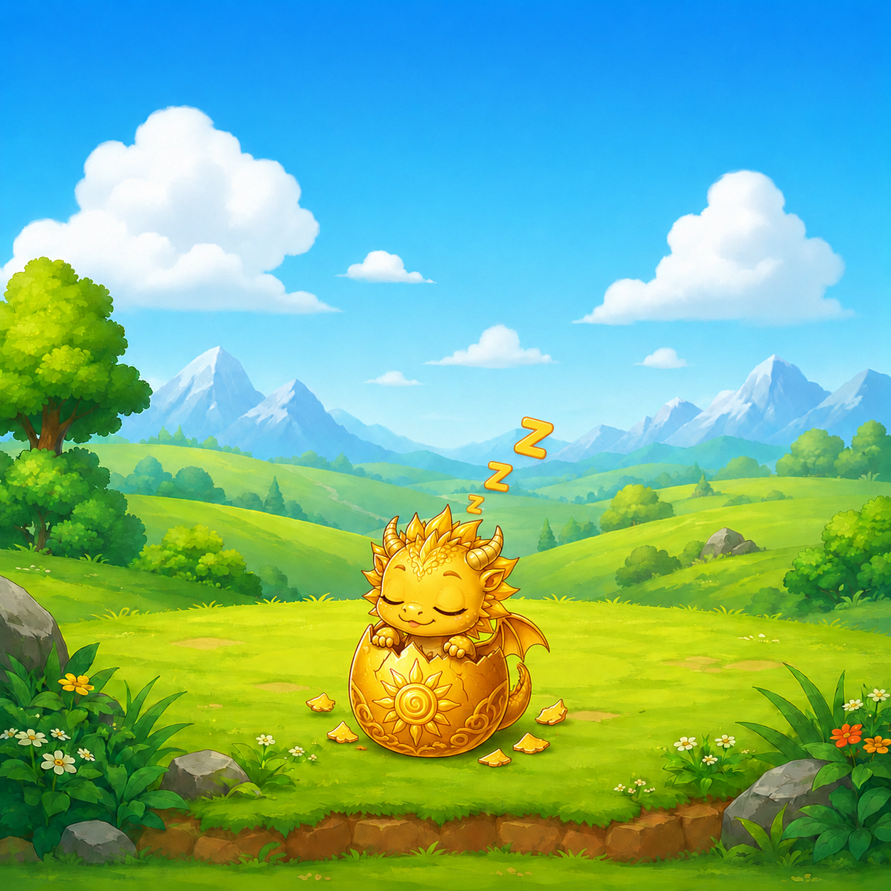
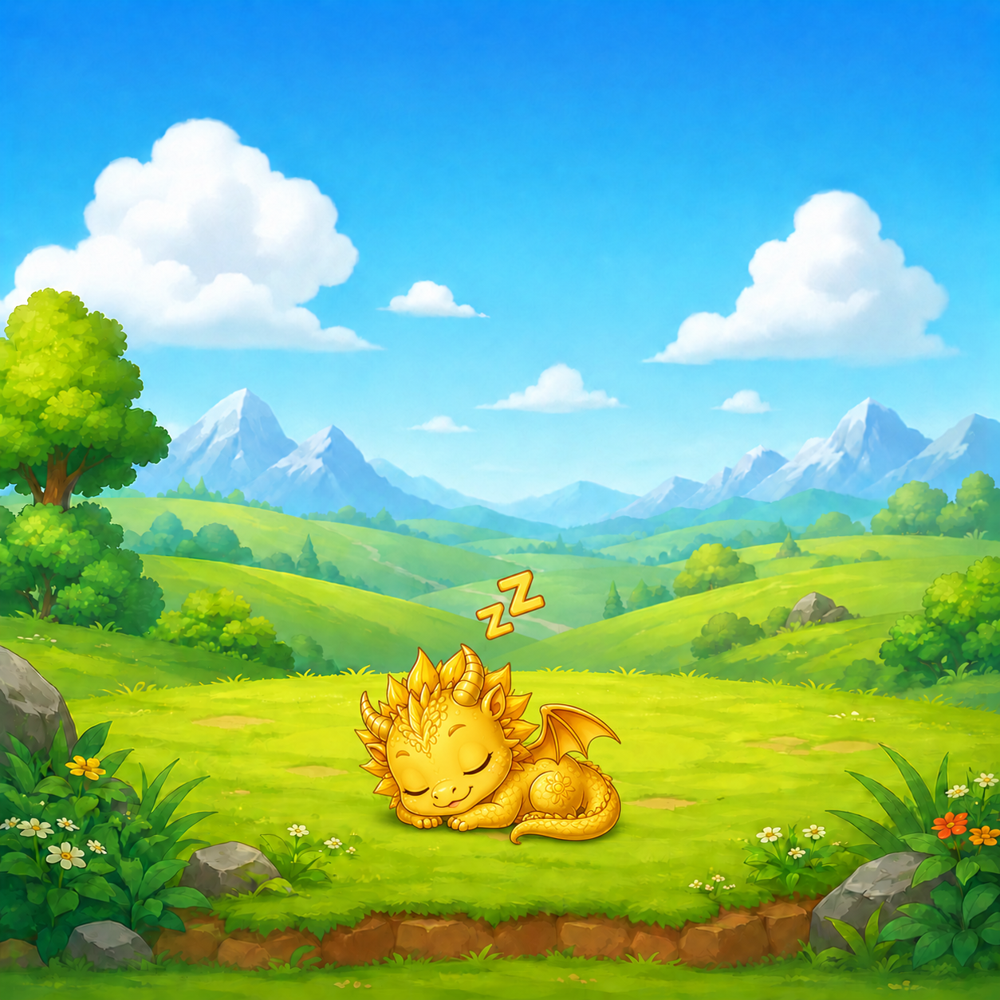
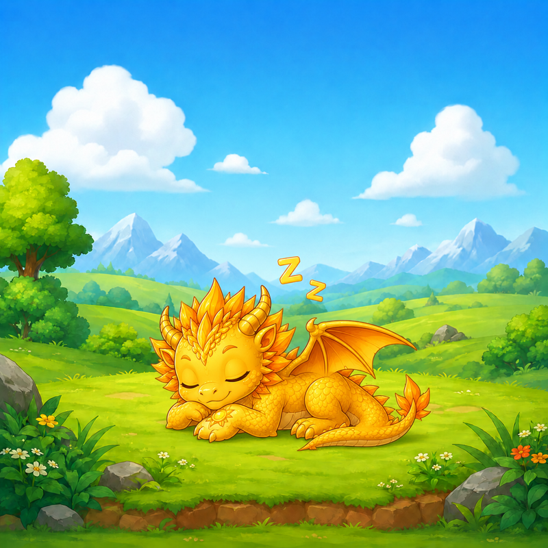
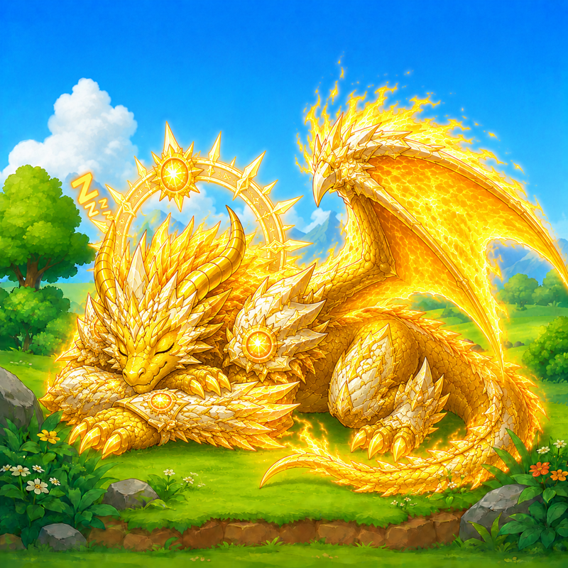
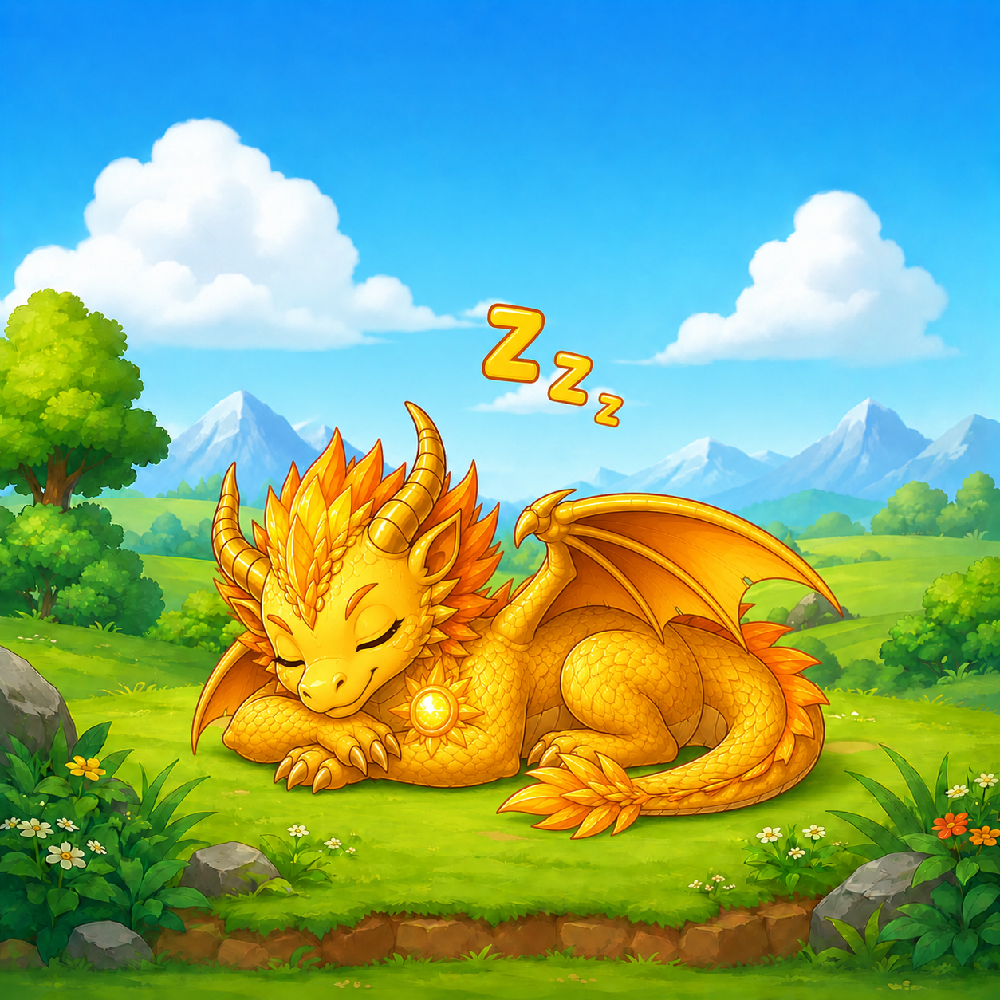
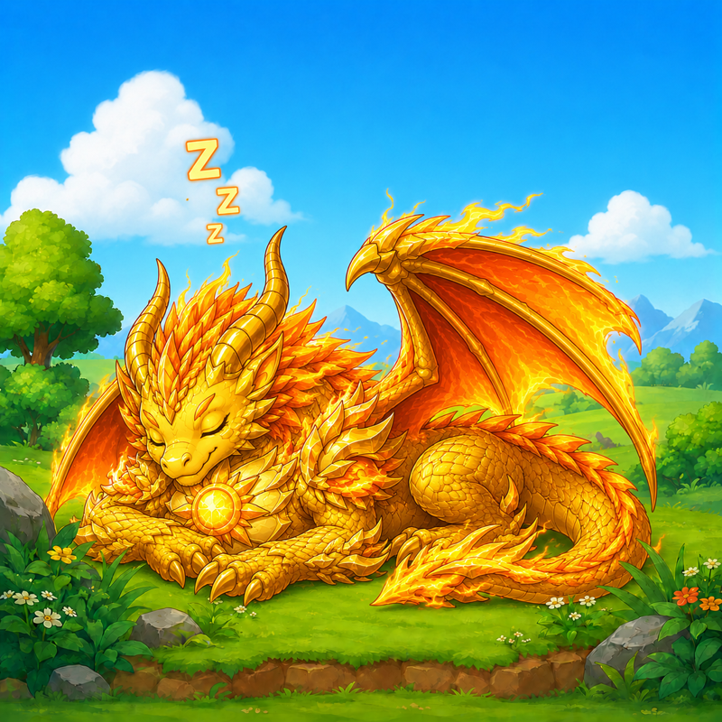

# ToDoMon

     


A to-do app disguised as a virtual pet game. Finish real tasks to feed, grow, and evolve your Sun Dragon through 7 stages. **Shipped to the iOS App Store.**

**[Download on the App Store](https://apps.apple.com/app/id6776013029)**

---

## Dragon Evolution — 7 Stages

| Egg | Hatchling | Baby | Juvenile | Teen | Adult | Ancient |
|:---:|:---:|:---:|:---:|:---:|:---:|:---:|
|  |  |  |  |  |  |  |

Complete tasks to earn XP and evolve your dragon through all 7 stages.

---

## What Makes This Different

Most habit apps guilt-trip you. ToDoMon turns your task list into a creature-care loop: your dragon gets hungry if you skip tasks, sleeps when inactive, and evolves when you maintain streaks. The mechanics are grounded in real behavioral psychology (variable reward, loss aversion, social sharing).

---

## Features

- **7-stage evolution** — Egg, Hatchling, Baby, Juvenile, Teen, Adult, Ancient
- - **Full game loop** — hunger, mood, sleep, XP, streaks, quests, trophies, diary memories
  - - **Cosmetics system** — unlockable skins and backgrounds
    - - **Share cards** — shareable milestone images for social media
      - - **Haptics and sound** — native iOS haptic feedback and audio cues
        - - **Offline-first** — all state lives on-device, no account required
          - - **RevenueCat Pro IAP** — one-time unlock for premium cosmetics and bonus celebrations
            - - **Smart review prompts** — App Store review request timing
              - - **Vitest unit tests** — game economy, quests, stage progression, streaks, notifications
               
                - ---

                ## Tech Stack

                | Layer | Technology |
                |---|---|
                | Frontend | React 18, TypeScript 5.5, Vite, Tailwind CSS |
                | Native shell | Capacitor iOS |
                | State / persistence | Local device storage (no backend) |
                | IAP | RevenueCat / StoreKit — product: `todomon_pro` |
                | Testing | Vitest |
                | Screenshots | Custom capture scripts in `scripts/` |

                ---

                ## What This Code Shows

                - **React + Capacitor** — packaging a web app for native iOS distribution
                - - **Offline-first architecture** — zero backend, all state in localStorage
                  - - **Game loop design** — hunger decay timers, XP curves, multi-stage evolution
                    - - **RevenueCat integration** — StoreKit IAP with receipt validation
                      - - **Unit-tested game logic** — deterministic tests for non-UI game systems
                        - - **App Store ship workflow** — screenshots, metadata, review prompts, release notes
                         
                          - ---

                          ## Local Development

                          ```bash
                          cd frontend
                          npm install
                          npm run dev
                          ```

                          App runs at http://localhost:5173 in browser mode. All game state is stored in localStorage.

                          ## Running Tests

                          ```bash
                          cd frontend
                          npm test
                          ```

                          Covers: game economy, quest unlock logic, stage progression, streak calculation, notification scheduling, review prompt timing, and share card generation.

                          ## iOS Build

                          ```bash
                          npm run build
                          npx cap sync ios
                          ```

                          Then open `ios/` in Xcode and archive for App Store submission.

                          - Bundle ID: `com.sonnymay.todomon`
                          - - App Store Connect app ID: `6776013029`
                            - - Screenshot sets: `app-store-screenshots/`
                              - - Ship notes: `HANDOFF.md`, `docs/SHIP_PLAN.md`, `docs/IAP_SETUP.md`
                                - - Xcode version: 16.x (required for iOS 18 target)
                                 
                                  - ---

                                  ## License

                                  MIT
